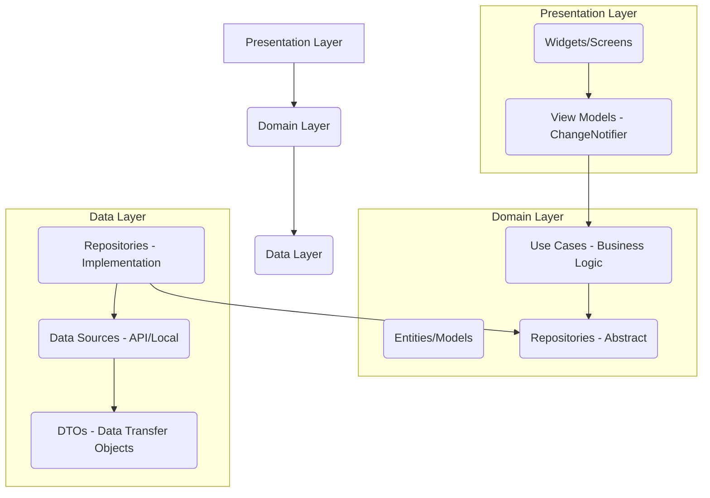

# DESIGN.md

## 1. Overview

This document outlines the design for the **HurryFoods** mobile application. HurryFoods is a Flutter-based mobile app for the end-user (the consumer) to purchase surplus food from various stores at a discounted price before it expires. This document details the proposed architecture, UI/UX principles, and technical specifications for the client-side application.

## 2. The Goal: Reducing Food Waste

The primary goal of HurryFoods is to create a marketplace that connects consumers with businesses (restaurants, cafes, grocery stores) that have surplus food at the end of the day. This provides a win-win situation:
-   **Consumers** get food at a lower price.
-   **Businesses** reduce food waste and recover some of the cost of goods that would otherwise be discarded.
-   **The environment** benefits from reduced food waste.

This design document is specifically for the **consumer-facing mobile application**.

## 3. Alternatives Considered

### Cross-Platform Frameworks

-   **React Native:** A popular choice for cross-platform development. However, Flutter was chosen due to its single codebase for UI and logic, expressive UI capabilities, and excellent performance.
-   **Native (Swift/Kotlin):** Developing separate native apps would provide the best possible performance and platform integration. However, this approach is more expensive and time-consuming, requiring two separate development teams and codebases.

### State Management

-   **BLoC/Cubit:** A popular and powerful state management solution in the Flutter community. It provides a clean separation between business logic and the UI. However, for this project, we will start with the simpler, built-in `ChangeNotifier` and `ValueNotifier` as per the project guidelines. This approach is easier to understand and implement for small to medium-sized applications. If the app's complexity grows significantly, we can reconsider BLoC.
-   **Riverpod:** A modern and flexible state management library that is gaining popularity. It offers compile-safe dependency injection and state management. However, to adhere to the principle of favoring built-in solutions, we will not use Riverpod at this stage.

## 4. Detailed Design

The application will be built using a layered architecture to ensure a clean separation of concerns, making the app scalable, maintainable, and testable.

### 4.1. Architecture: Layered Approach

We will adopt a layered architecture inspired by the principles of Clean Architecture.

-   **Presentation Layer (`lib/presentation`):** Responsible for the UI.
    -   **Widgets/Screens:** Reusable UI components and full-screen views.
    -   **View Models (`ChangeNotifier`):** Classes that hold the UI state and business logic for each screen, interacting with the domain layer.
-   **Domain Layer (`lib/domain`):** The core of the application, containing the business logic. It is independent of the other layers.
    -   **Entities/Models:** Plain Dart objects representing the core data structures (e.g., `Store`, `Product`, `Order`).
    -   **Repositories (Abstract):** Abstract classes that define the contract for data operations (e.g., `abstract class StoreRepository { ... }`).
    -   **Use Cases:** Classes that encapsulate a single piece of business logic (e.g., `GetFeaturedStoresUseCase`).
-   **Data Layer (`lib/data`):** Responsible for data retrieval and storage.
    -   **Repositories (Implementation):** Concrete implementations of the repository interfaces from the domain layer.
    -   **Data Sources:** Classes that fetch data from remote APIs (e.g., using the `http` package) or local storage (`shared_preferences`).
    -   **DTOs (Data Transfer Objects):** Models used for parsing JSON data from the API, which are then mapped to domain entities.

### 4.2. State Management

-   **`ChangeNotifier` with `ListenableBuilder`:** For complex and shared app state (e.g., user authentication, shopping cart).
-   **`ValueNotifier` with `ValueListenableBuilder`:** For simple, local UI state (e.g., a selected filter option).
-   **`FutureBuilder` and `StreamBuilder`:** For handling asynchronous operations and updating the UI based on the result.

### 4.3. Navigation

-   **`go_router`:** For declarative routing, deep linking, and handling navigation flows (e.g., authentication).

### 4.4. UI/UX Principles

The UI will be designed with the following principles in mind:
-   **Simplicity and Clarity:** A clean, uncluttered interface with a clear visual hierarchy.
-   **High-Quality Visuals:** Appetizing images of food to attract users.
-   **Intuitive Navigation:** A fixed bottom navigation bar for easy access to the main sections of the app (Home, Search, Orders, Profile).
-   **Seamless Onboarding:** A simple sign-up/login process with social login options.
-   **Personalization:** Displaying relevant stores and offers based on the user's location.
-   **Transparent Checkout:** A clear and simple checkout process with no hidden fees.
-   **Real-time Tracking:** Real-time updates on the order status.

### 4.5. Key Features

-   **User Authentication:** (Login/Sign-up)
-   **Home Screen:**
    -   Display a list of featured "surprise bags" from nearby stores.
    -   Search bar.
    -   Categories (e.g., "Baked Goods", "Groceries").
-   **Store Details Screen:**
    -   Information about the store (name, address, rating).
    -   Details of the "surprise bag" (description, price, pickup time).
-   **Shopping Cart:**
    -   Review the selected items.
    -   Proceed to checkout.
-   **Checkout Process:**
    -   Select payment method.
    -   Confirm order.
-   **Order Confirmation & Tracking:**
    -   Display order details and a QR code for pickup.
    -   Show the pickup time.
-   **User Profile:**
    -   View order history.
    -   Manage personal information and payment methods.

## 5. Summary of Design

The HurryFoods app will be a Flutter application following a modern, scalable, and maintainable architecture. It will prioritize a clean and intuitive user experience, leveraging Flutter's built-in state management solutions and the `go_router` package for navigation. The design focuses on a clear separation of concerns, which will facilitate testing and future development.

## 6. Research References

-   [Too Good To Go App Architecture](https://www.google.com/search?q=too+good+to+go+app+architecture)
-   [Flutter Food Delivery App Architecture](https://www.google.com/search?q=flutter+food+delivery+app+architecture)
-   [UI/UX Best Practices for Food Ordering Apps](https://www.google.com/search?q=UI%2FUX+best+practices+for+food+ordering+apps)
-   [Flutter State Management for E-commerce App](https://www.google.com/search?q=Flutter+state+management+for+e-commerce+app)

---
Please review this design document. Once you approve it, I will create a detailed implementation plan.
